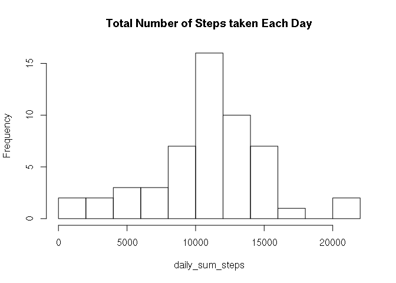
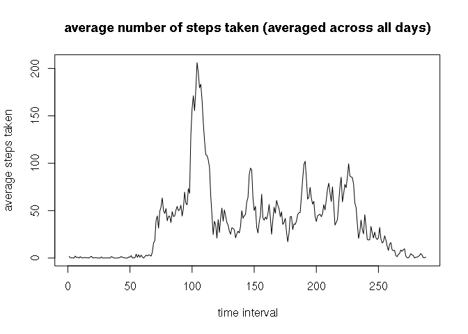
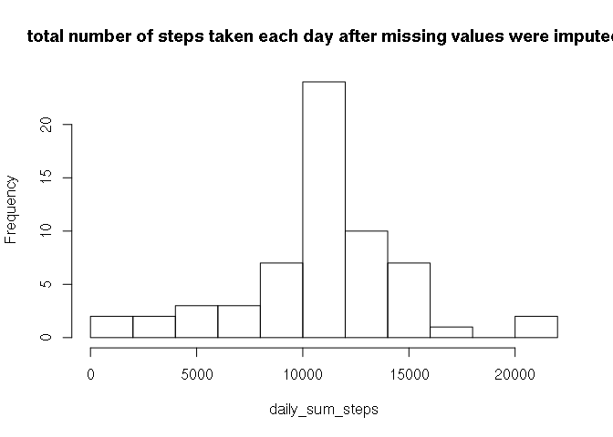
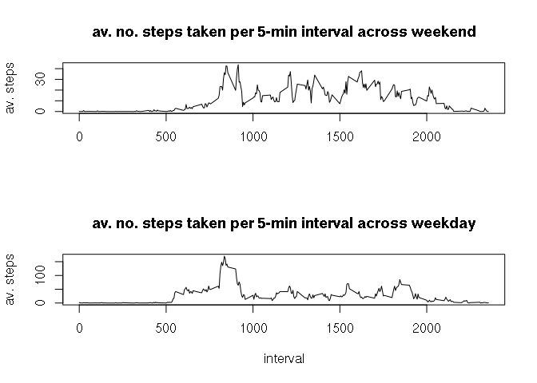

# Reproducible Research: Peer Assessment 1


## Loading and preprocessing the data

```r
activity <- read.csv("activity.csv")
activity2 <- activity
activity2["steps"]<-activity["steps"]+1
arr_activity2 <- xtabs(steps~date+interval,data=activity2)
arr_activity2[arr_activity2==0] <- NA
arr_activity <- arr_activity2-1
```

## What is mean total number of steps taken per day?

```r
daily_sum_steps <- rowsum(activity[["steps"]],activity[["date"]],na.rm=FALSE)
hist(daily_sum_steps, breaks=12, main="Total Number of Steps taken Each Day")
```

 

The mean and median number of steps each day are


```r
mea1 <- mean(daily_sum_steps[,1], na.rm=TRUE)
med1 <- median(daily_sum_steps[,1], na.rm=TRUE)
mea1
```

```
## [1] 10766.19
```

```r
med1
```

```
## [1] 10765
```

## What is the average daily activity pattern?


```r
int_mean <- colMeans(arr_activity, na.rm=TRUE)
plot(int_mean, type="l", xlab="time interval", ylab="average steps taken", main="average number of steps taken (averaged across all days)")
```

 

```r
labels(int_mean)[which.max(as.numeric(int_mean))]
```

```
## [1] "835"
```
is the 5-minute interval that, on average, contains the maximum number of steps.

## Imputing missing values
Number of missing days is


```r
sum(is.na(activity[["steps"]]))
```

```
## [1] 2304
```

Strategy for imputing missing data: Replace missing values with mean of that 5min interval, mean taken over all days.


```r
al <- as.numeric(unlist(activity["steps"]))
for(i in 1:length(activity[[3]])){
        if(is.na(activity[i,1])){
                activity[i,1] <- int_mean[[as.character(activity[i,3])]]
        }
}
head(activity)
```

```
##       steps       date interval
## 1 1.7169811 2012-10-01        0
## 2 0.3396226 2012-10-01        5
## 3 0.1320755 2012-10-01       10
## 4 0.1509434 2012-10-01       15
## 5 0.0754717 2012-10-01       20
## 6 2.0943396 2012-10-01       25
```
What is mean total number of steps taken per day, with imputed data?

```r
daily_sum_steps <- rowsum(activity[["steps"]],activity[["date"]],na.rm=FALSE)
hist(daily_sum_steps, breaks=12, main="total number of steps taken each day after missing values were imputed")
```

 

The mean and median number of steps per day with imputed mean data are


```r
mea2 <- mean(daily_sum_steps[,1], na.rm=TRUE)
med2 <- median(daily_sum_steps[,1], na.rm=TRUE)
mea2
```

```
## [1] 10766.19
```

```r
med2
```

```
## [1] 10766.19
```

and the difference to the previous mean and median are


```r
mea2-mea1
```

```
## [1] 0
```

```r
med2-med1
```

```
## [1] 1.188679
```

thus the mean does not differ (by construction), but the median does: non-integer values for the total number of steps is allowed by using the mean as imputed data, and the median as a sum over at least one of these double values is a double, too.

## Are there differences in activity patterns between weekdays and weekends?


```r
activity$day <- ifelse(weekdays(as.Date(activity$date)) == "Sunday" | weekdays(as.Date(activity$date)) == "Saturday","weekend", "weekday")
act_weekend <- activity[activity$day=="weekend",]
act_weekday <- activity[activity$day=="weekday",]
arr_weekend <- xtabs(steps~date+interval,data=act_weekend,sparse=TRUE)
arr_weekday <- xtabs(steps~date+interval,data=act_weekday,sparse=TRUE)
mean_weekend <- colMeans(as.matrix(arr_weekend), na.rm=TRUE)
mean_weekday <- colMeans(as.matrix(arr_weekday), na.rm=TRUE)
layout(1:2)
plot(as.numeric(mean_weekend)~labels(mean_weekend),type='l',ylab='av. steps',xlab='',main="av. no. steps taken per 5-min interval across weekend")
par(new=FALSE)
plot(as.numeric(mean_weekday)~labels(mean_weekday),type='l',ylab='av. steps',xlab="interval", main="av. no. steps taken per 5-min interval across weekday")
```

 
